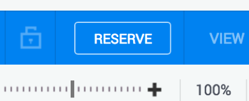
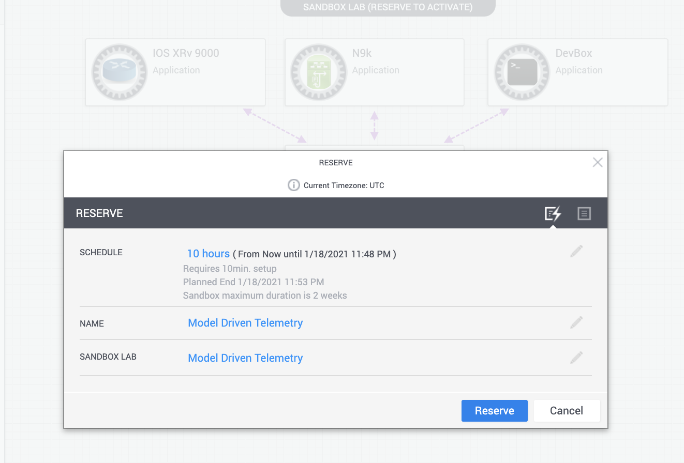
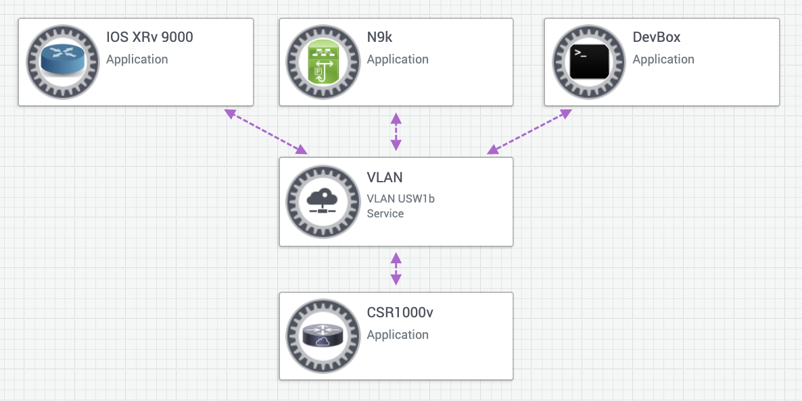

# Telemetry Collector

Automatically build telemetry collector with telegraf, influxdb and chronograf, example of sensor paths is using native yang model and OpenConfig yang model of nx-os as example. `build.sh` script will create self-signled cerificates for TLS transport. Using docker images of telegraf, influxdb and chronograf to create services with docker-compose. tested with `telegraf>=1.12.1`, `influxdb>=1.8.0` and `chronograf>=1.8.4`.


## Prerequisites

Reserve the Model Driven Telemetry sandbox



> You will need to be logged in to https://devnetsandbox.cisco.com/ before you can reserve.

Take some time to reserve and familiarize yourself with the [Model Driven Telemetry Sandbox](https://devnetsandbox.cisco.com/RM/Diagram/Index/0e053963-b039-4a15-94f6-54db2f5ad61c?diagramType=Topology) on Devnet.
Getting started is straightforward - once you click the above URL, click the Reserve button on the top right:

> To view the dropdown menu with variable reservation options, click the edit button (pencil icon) next to schedule. Once your reservation is active, you can keep extending the duration if you start running out of time (with the maximum limit set to a total time of 2 week)




Once reserved, expect an initial email (associated with your login) indicating that your sandbox environment is being set up.
Within 10 minutes, the entire sandbox environment should be ready and you will get another email detailing the [Anyconnect](https://developer.cisco.com/site/devnet/sandbox/anyconnect/) server and credential information you need to connect to the same network as the sandbox environment.

These instructions and more are detailed here: [Reserving and Connecting to a Devnet Sandbox](https://developer.cisco.com/docs/sandbox/#!first-reservation-guide/connect-to-sandbox-servers)

## Connect to the Sandbox

Once you are connected to the Anyconnect server (Your endpoint/gateway may vary)


You should be able to ping the address `10.10.20.50` which represents the External NAT address of the virtualization host on which the devbox instances and the development environment (devbox) are running.

The topology that you will have access to is shown below:



## Requirements:
docker-ce, openssl, docker-compose, any linux distribution, see Known Issues if trying it on MacOS
## How to use

 1. to quick start, use `sudo ./build.sh start` to start the containers:
    ```bash
     # ./build.sh start  
    2020-07-30T22:49:02--LOG--influxdb database folder is not existed, creating one
    2020-07-30T22:49:02--LOG--change permission of config and data folder of influxdb
    2020-07-30T22:49:02--LOG--gernerating self-signed certificates for telegraf plugins
    2020-07-30T22:49:02--LOG--telegraf certificate does not exist, generating
    2020-07-30T22:49:02--LOG--gernerating private key for CN telegraf
    ...<ommited>
    ```

    By default, telegraf listens on `tcp:57000` for gRPC dial-out, if you want to modify the port, change the config file `etc/telegraf/telegraf.conf` in project folder

    gnmi dial-in is also enabled by default,  modify the `switches` in `build.sh` with mgmt address and grpc port:
    ```ini
    # swtiches accept gNMI dial-in
    switches=( "172.25.74.70:50051" "172.25.74.61:50051" )
    ```
    To change the username and password of gnmi plugin modify it in `build.sh`:
    ```ini
    # user on swtich for authentication, need network-operator role at least
    gnmi_user="telemetry"
    gnmi_password="cisco123"
    ```

    
    When first start the service, script will check if certificates are genearted, if not will create them for mdt and gnmi plugin validate for 10 years.
    use `http://<ip_address_of_host>:8888` to open chronograf gui.

2. TLS is enabeld on cisco_telemetry_mdt plugin, comment below lines in `etc/telegraf/telegraf.conf` to disable it:
    ```ini
    # uncomment below to enable tls for dial-out plguin
    tls_cert = "/etc/telegraf/cert/telegraf.crt"
    tls_key = "/etc/telegraf/cert/telegraf.key"
    ```
    certificate `./etc/telegraf/cert/telegraf.crt` need be copied to nx-os to verify the collector's identity, then use below command to enabled TLS transport for destination group, the `<certificate name>`  needs match the common name of `telegraf.crt`, it is set to `telegraf` in `build.sh`:
    ```
    switch(config)# telemetry
    switch(config-telemetry)# destination-group 1
    switch(conf-tm-dest)# ip address <collector address> port 57000 protocol gRPC encoding GPB
    switch(conf-tm-dest)# certificate /bootflash/telegraf.crt <certificate name>

    ```
3. TLS need be enabled for gNMI plugin as well as nx-os, when configure feature gRPC on switch, a default certificate with 1 day validation is auto-generated, to configure the certificate for gRPC on nx-os, copy `etc/telegraf/cert/gnmi.pfx` to bootflash, then use below commands to import the certificate, the `<export password>` is set to `cisco123` by default, you could modify it in `build.sh`
    ```
    switch(config)# crypto ca trustpoint gnmi_trustpoint
    switch(config-trustpoint)# crypto ca import gnmi_trustpoint pkcs12 bootflash:gnmi.pfx <export password>
    switch(config)# grpc certificate gnmi_trustpoint
    ```
4. It will import two pre-built dashboards. `fabric_dashboard` is example of querying data from telemetry dial-out, you can find the example of swtich telemetry config that is used for this dashboard in [telemetry.cfg](/examples/telemetry.cfg), `fabric_dashboard_gnmi` is example of querying data from gNMI dial-in.

5. Example of telegraf configuration can be found below:
   - [telegraf.conf](etc/telegraf/telegraf.conf) example of cisco_telemetry_mdt config
   - [gnmi.conf.example](etc/telegraf/telegraf.d/gnmi.conf.example) exmaple of sample-based gnmi plugin config
   - [gnmi_on_change.conf.example](etc/telegraf/gnmi_on_change.conf.example) exmaple of event-based plugin config
   

## Known issue
1. Currently on nx-os, a single subscription of gNMI dial-in can only be SAMPLE or ON_CHANGE, not both. In order to configure different type of subscription, need start two telegraf instances with different gNMI plugin configuraiton.
Please refer to enhancement [CSCvu58102](https://bst.cloudapps.cisco.com/bugsearch/bug/CSCvu58102) for detail and this limiation will be removed in future release.
2. MacOS uses BSD version of sed by default which doesn't work with this script, use `brew install gnu-sed` to install the gnu version of sed if you are trying this script on MacOS.


## Reference
1. [Cisco Nexus 9000 Series NX-OS Programmability Guide, Release 9.3(x)](https://www.cisco.com/c/en/us/td/docs/switches/datacenter/nexus9000/sw/93x/progammability/guide/b-cisco-nexus-9000-series-nx-os-programmability-guide-93x.html)
